<h2 align="center"> <b>Hello! Welcome!</b></h2>

<h1> ⠀⠀⠀⠀⠀⠀⠀⠀⠀⠀⠀⠀⠀⠀⠀⠀⠀📊 GitHub Stats</h1>

| DevScore | Top Languages |
| --- | --- |
|  |  |

<h2>Skills</h2>

<!-- Language -->
<h3>• Language</h3>

<!-- Website -->
<h3>• Website</h3>

<!-- Database -->
<h3>• Database</h3>

<!-- Software & Tools -->
<h3>• Software & Tools</h3>

<picture>
  <source media="(prefers-color-scheme: dark)" srcset="https://raw.githubusercontent.com/Rafaellaerin/Rafaellaerin/output/github-contribution-grid-snake-dark.svg">
  <source media="(prefers-color-scheme: light)" srcset="https://raw.githubusercontent.com/Rafaellaerin/Rafaellaerin/output/github-contribution-grid-snake.svg">
  
</picture>
